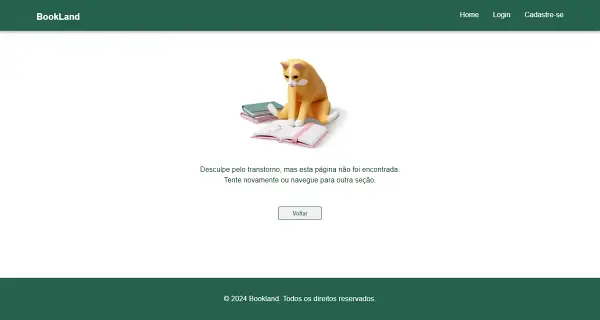
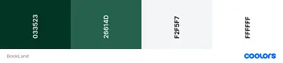

Projeto Final Módulo Redux

### Livraria BookLand
[Clique aqui para visualizar o site]()

***

## Índice
* [1. Prefácio](#1-prefácio)
* [2. Orientações para a Tarefa](#2-orientações-para-a-tarefa)
* [3. Detalhamento](#3-detalhamento)
  * [3.1 Paleta de Cores](#31-paleta-de-cores)
* [4. Instruções para acessar o projeto](#4-instruções-para-acessar-o-projeto)
* [5. Desenvolvedores](#5-desenvolvedores)

***

## 1. Prefácio

Quinta atividade do módulo de *Redux* desenvolvida para o programa de estágio Vem Ser da empresa DBC Company - turma 13, que tem como objetivo desenvolver as nossas habilidades com o *Redux RTK Query* integrando o conhecimento adquirido em aula.

## 2. Orientações para a Tarefa

Criar um sistema de Livraria online onde:
- Cadastro e login de user;
- Área logada;
- Listagem de livros com preço;
- Adicionar ao carrinho;

Trabalhar com as seguintes *APIs*:

- [Reqres](https://reqres.in/)

- [Google *Books APIs*](https://developers.google.com/books/docs/v1/using?hl=pt-br)

**Requisitos:**

- *Redux RTK Query*;
- Estilização básica;
- Usar os métodos *GET* e *POST*;
- Ter área logada;

## 3. Detalhamento

Para esta tarefa, criamos a aplicação de livraria *on-line* de nome **BookLand** com as seguints funcionalidades:

- *Home*
  - Começando pelo *Header*, o menu é dinâmico e se modifica  ao efetuar o *login*. Sem usuário *logado*, aparecem as opções de navegação para as telas de "*Home*", "*Login*" e "Cadastre-se". Com usuário *logado* as opções de navegação se alteram para "*Home*", "Carrinho" e "*Logout*".

  - É possível realizar buscas pelo nome do livro no *input* de pesquisa.

  - Os *cards* dos livros renderizados na tela, contam com nome, autor e preço, além do botão comprar que ao clicar verifica se existe um usuário *logado*, caso não tenha, o usuário é redirecionado para a tela de *Login*. 
  Após realizar o *login*, quando clicar no botão comprar, o mesmo fica selecionado e é incluso à página de "Carrinho".

  - A *Home* também conta com o recurso *skeleton* e paginação.

- Carrinho
  - A opção de navegar para a página de carrinho somente é disponibilizada após o usuário se *logar* na aplicação.

  - No carrinho é possível remover o livro selecionado ou voltar à *home* para escolher outros livros.

- *NotFound*
  - Criamos uma tela dedicada para a caso a rota não seja encontrada.
  
  

Todas as páginas são responsivas.

  ### 3.1 Paleta de cores
   
  

***

## 4. Instruções para acessar o projeto

Para configurar e executar o projeto, siga as instruções abaixo:

**Clonar o Projeto:**
Execute o comando `git clone https://github.com/thalessalla/livraria.git` para clonar o repositório em sua máquina local.

**Instalação das Dependências:**
Execute o comando `npm install` na raiz do projeto para instalar todas as dependências necessárias.

**Iniciar o Projeto:**
Utilize o comando `npm start` na raiz do projeto

**Para realizar o login**
Utilize as seguintes credenciais para realizar o *login*:

- **email**: `eve.holt@reqres.in` 
- **senha**: `cityslicka`

**Para realizar o cadastro**
Utilize as seguintes credenciais para realizar o cadastro:

- **email**: `eve.holt@reqres.in` 
- **senha**: `pistol`

 ***

  ### 5. Desenvolvedores 

  #### Camila Gonçalves   
  [Linkedin](https://www.linkedin.com/in/camilanpgoncalves/) | [Github](https://github.com/CamilaVerso)
   

 #### Thales Salla   
 [Linkedin](https://www.linkedin.com/in/thales-salla/) | [Github](https://github.com/thalessalla)
   

  ***